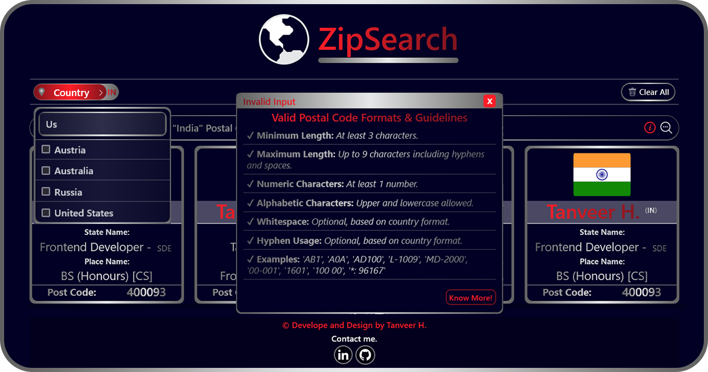

Sure, here's an improved version of the README:

# Tanveer's ZipSearch: The Ultimate Postal Code Information App

Welcome to ZipSearch! Developed by Tanveer H., this application redefines your interaction with postal codes. More than just a tool, it offers a streamlined and interactive experience, providing easy access to global postal code data via the https://api.zippopotam.us API.

## Features

- **Global Postal Discovery**: Effortlessly select a country with our enhanced country selector, featuring quick, debounce-optimized search functionality.
- **Zip Code Magic**: Input your postal code, and let ZipSearch take care of the rest!
- **Instant Feedback**: Stay informed with our sleek loading spinner while we fetch the latest data for you.
- **Location Insights**: Enjoy a rich display of location information, including the country, state, and place name.
- **Smart Error Responses**: Navigate through unexpected situations effortlessly. We offer customized messages for failed API calls and a specialized modal dialog for incorrect postal codes.
- **Search History**: Retrace your steps with our record of your past searches.
- **Responsive UI**: A seamless user experience across various screen sizes and devices.
- **A11y (Accessibility)**: Ensuring accessibility for all users, including those with disabilities.

## How ZipSearch Works

1. **Country Selection**: Begin by choosing your country from the dropdown. Our debounce-optimized search is here to help you find a country swiftly.
2. **Postal Code Entry**: Simply enter the postal code for your selected country.
3. **Loading Phase**: A brief pause while ZipSearch retrieves your data.
4. **Data Unveiling**: Upon successful retrieval, enjoy a detailed presentation of the location information.
5. **Error Handling**: Should any issues arise, you will be provided with a clear error message or a useful modal dialog for incorrect postal codes.

## Technologies Used

- [React](https://reactjs.org/): For crafting dynamic user interfaces.
- [Redux-ToolKit](https://redux-toolkit.js.org/): The go-to state container for managing the application state.
- [React-Query](https://react-query.tanstack.com/): Masterfully handling data fetching, caching, and state management.
- [React-Country-Flag](https://www.npmjs.com/package/react-country-flag): A nifty library for rendering country flags in React.
- [Tailwind CSS](https://tailwindcss.com/): Injecting style and visual appeal into the application.
- [Vite](https://vitejs.dev/): Boosting the development experience with a speedy build tool.

## Technical Highlights

- **Optimization**: Debounce integration for smooth and efficient country searches.
- **Modularity**: Tightly organized components facilitate easy maintenance.
- **Error Handling**: Comprehensive scenario coverage, from validating postal codes to displaying the correct messages and dialogs.
- **Modal Dialogs**: Assistance in understanding valid postal codes.
- **History Management**: A thoughtful record of your search history.
- **User Experience**: Ensuring responsive design and user-friendly interactions for a top-notch experience.
- **Accessibility**: Adhering to A11y standards to guarantee inclusivity for all users.

## Getting Started

1. Clone this repository.
2. Install dependencies using `npm install`.
3. Start the development server using `npm run dev`.
4. The app should now be running on [http://localhost:3000](http://localhost:3000).

## Deployment

The app is deployed using Vercel. It is automatically built and deployed upon pushing changes to the main branch. You can visit the live site [here](https://tanveer-zipsearch.vercel.app).

## Usage

Feel free to explore the app and learn more about my projects and skills. If you're interested in collaboration or have any questions, use the contact form to get in touch.

## Contact

If you have any questions or feedback about the app, you can reach out to me through my website: [My Portfolio Website](https://tanveer-portfolio.vercel.app/en-US).

---
**Thanks for exploring ZipSearch!**
---